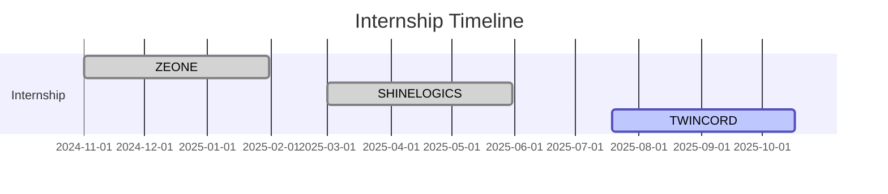

<h1 align="center">Hi 👋, I'm Vijayakanth M</h1>
<h3 align="center">🚀 AI/ML Engineer | 💻 Full Stack Developer | 🧠 Problem Solver</h3>

  

---

### 🧠 About Me

- 🎓 AI & ML Undergrad at **Kongu Engineering College**, Erode
- 🔍 Exploring Deep Learning, NLP, and Large Language Models
- 💡 Building real-world AI + MERN projects for social impact
- 🥇 Multiple Hackathon and Paper Presentation Winner
- 📫 Contact: [vikymahendiran123@gmail.com](https://mail.google.com/mail/?view=cm&fs=1&to=vikymahendiran123@gmail.com)
- 🌐 Portfolio: [vkportfolio-8a5cb.web.app](https://vkportfolio-8a5cb.web.app)

---

### 🌐 Connect With Me

  
  
  

---

### 💼 Skills & Tools

---

### 📊 GitHub Stats

  
  
  

---

### 🧠 LeetCode Stats

  

---

### 🚀 Notable Projects

| Project | Tech Stack | Description |
|--------|-------------|-------------|
| **Fruit & Veg Identifier** | Flask, Groq LLM | Real-time produce recognition using LLM vision & embeddings |
| **AI Study Buddy** | Telegram API, Flask, NLP | Reminder + Q&A bot for academic productivity |
| **Attendance Automation** | MERN | Reduced 1.5hr attendance to 10min using a web interface |
| **DCGRAM** | MERN | Instagram-style app with followers, stories, and feed |
| **Stock Portfolio Manager** | Flask, Matplotlib, LLM | Portfolio analysis from CSV with AI suggestions |
| **Refined CAPTCHA** | ML, JS | Behavioral bot detection alternative to CAPTCHA |

---

### 🧪 Internship Timeline

---

### 🏅 Achievements

- 🥇 1st Place — Hacksphere 2025 (24hr Hackathon)
- 🥇 1st — PRODOTHON & ENVISTAS 2025 Paper Presentations
- 🥉 3rd — AUTONIX 2024 Paper Presentation
- 🏆 Best Presentation & Team — BYTS INDIA HACKATHON 2025

---

### 📜 Certifications

- 📌 MongoDB Associate Developer (Mongo University)
- 📌 Ethical Hacking - NPTEL Certification

---

### ⚡ Fun Facts

- 💬 Love building chatbots powered by LLMs  
- 🧠 I design & deploy AI/ML systems from scratch  
- 🎥 Passionate about animation & editing using Blender  
- 🔥 Hackathons fuel my creativity — always up for a challenge!

---

  

---

